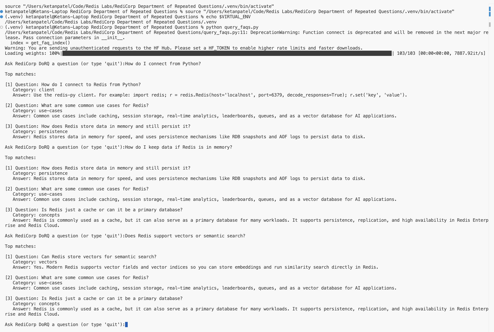
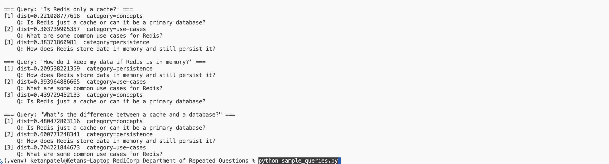

# Advanced Lab: RediCorp Department of Repeated Questions (DoRQ) — RedisVL Vector Lab

**Student:** Ketan Patel  
**Date:** 2026-09-15  
**Environment:** Redis Cloud  
**Stack:** redisvl, sentence-transformers (all-MiniLM-L6-v2), redis-py

---

## 1. How I ran Redis

I used my existing Redis Cloud database rather than spinning up the `redis:8` Docker container the lab defaults to. Redis Cloud already runs Redis 8 with Search and vector indexing enabled, so there's no functional difference from the Docker path — same `FT.CREATE`/vector support either way. I had Claude Code wire the Redis connection URL into the right places in the project so the scripts could connect.

---

## 2. How I configured the index

The index has four fields. `question` and `answer` are `text` fields (full-text searchable, though this lab doesn't use that directly). `category` is a `tag` field — exact-match/filterable, not full-text, which fits since categories are a fixed small set (`concepts`, `client`, `persistence`, `use-cases`, `vectors`). `embedding` is the `vector` field, configured with `dims: 384`, `algorithm: hnsw`, and `distance_metric: cosine`.

`dims: 384` isn't a design choice so much as a requirement — it has to exactly match whatever embedding model produces the vectors, and `all-MiniLM-L6-v2` always outputs 384 numbers per input. If this were mismatched, Redis would reject every insert.

`hnsw` (Hierarchical Navigable Small World) is an *approximate* nearest-neighbor algorithm — it builds a graph linking each stored vector to its nearby neighbors, so a search can walk toward the closest matches instead of comparing against every stored vector. The alternative, `flat`, is exact brute-force comparison. With only 5 FAQs, the two would perform identically — the choice only matters at scale. I used `hnsw` because it's the standard production default and what you'd actually reach for outside a toy lab.

`cosine` distance measures the angle between two vectors rather than their raw magnitude, so two vectors pointing in roughly the same “meaning direction” score as similar even if one embedding is longer than the other. It's the standard metric for sentence-embedding models like this one.

---

## 3. Concepts

**What an embedding is** — A numerical representation of a piece of text: a fixed-length list of numbers (384 of them, here) produced by a model trained so that texts with similar *meaning* end up close together in that number-space, even if they don't share any words. It's computed once, locally, with `sentence-transformers` — no API call, no LLM involved.

**What the vector field/index in Redis does** — The `embedding` field on each hash stores that 384-number vector as a packed binary blob. Separately, the index (built with `FT.CREATE`, via RedisVL's `index.create()`) watches every hash under the `faq:` prefix and maintains an HNSW graph over their embedding vectors. That graph is what makes a “find the 3 closest vectors to this one” query fast — Redis doesn't compare your query against every stored vector one by one, it walks the graph toward the nearest matches.

**Why Redis is a good fit**

- Low-latency semantic lookup: the vectors live in memory alongside an already-fast key-value store, so a similarity search finishes in milliseconds even as the FAQ set grows — no separate network hop to a dedicated vector database.
- Combining vectors with other metadata fields (e.g. `category`, tags): because `category` is indexed as a `tag` field on the *same* hash, a single query could filter by category *and* rank by vector similarity together (e.g. “closest match, but only within the `persistence` category”) — something you'd otherwise have to bolt together yourself across two separate systems.

---

## 4. Example queries

I had Claude Code write a small, non-interactive test script (`sample_queries.py`) that reuses the project's own `get_faq_index()` helper and runs a batch of queries in one pass, printing each match's `vector_distance` alongside the answer so I could see not just what came back, but how confident the match actually was.

Three queries run against the live index:

- *“Is Redis only a cache?”* → top match `faq:1` (dist `0.221`) — nearly a direct rephrasing of “Is Redis just a cache or can it be a primary database?”, so the low distance and clean gap to #2 (`use-cases`, `0.304`) make sense.
- *“How do I keep my data if Redis is in memory?”* → top match `faq:3` (dist `0.210`) — a paraphrase of the persistence FAQ's own wording (“stores data in memory... persist it”), so again a close match with a clear margin over #2.
- *“What's the difference between a cache and a database?”* → top match `faq:1` (dist `0.480`) — more than double the distance of the other two queries' top hits. This question is genuinely more abstract than anything in the FAQ set as written; `faq:1` wins only because it's the closest *available* answer, not because it's actually close. The system doesn't know the difference between “confident match” and “best of a bad set” — it always returns 3 results regardless of how far away they really are. That's a real limitation worth carrying into section 6.

Lower `vector_distance` means a closer match. Queries 1 and 2 both show a big jump between the #1 result and #2/#3 — that gap is what a confident match looks like. Query 3's distances are higher and closer together across all three — that flatness is what the model “guessing” looks like, which is a stronger thing to point out than just reading off the top answer.

I also ran the lab's own provided `query_faqs.py` directly in the terminal, interactively, with three different questions spanning three different FAQ categories (`client`, `persistence`, `vectors`) to confirm the end-to-end tool behaves the way the lab describes, not just the scripted test harness above:

- *“How do I connect from Python?”* → top match `faq:2` (client) — an almost exact rephrasing of the stored question, correctly the #1 result.
- *“How do I keep data if Redis is in memory?”* → top match `faq:3` (persistence) — the same result as the scripted run above, confirming the two tools agree with each other.
- *“Does Redis support vectors or semantic search?”* → top match `faq:5` (vectors) — again a near-exact rephrasing, correctly on top.

### Screenshots

---

## 5. Productionizing this FAQ vector store

**Multi-tenant / per-application separation** — Right now everything lives under one `faq:` prefix in one index, fine for a single team's FAQ set. For multiple applications or customers sharing the same Redis, there are a few real options: give each tenant its own key prefix and its own index (cleanest isolation, but more indexes to manage and more per-index HNSW overhead); or keep one shared index but add a `tenant_id` tag field (like `category` here) and require every query to filter on it — cheaper to run, but a missing filter is a real data-leak risk, not just a bug. For access control specifically, Redis ACLs let you scope a set of credentials to only touch keys matching a given prefix pattern, so a team can only ever read/write its own tenant's data even if the index is shared.

**Index sizing and capacity planning** — Raw vector storage here is small: 384 floats × 4 bytes ≈ 1.5KB per entry, times 5 FAQs is nothing. What actually matters at scale is that HNSW's graph itself adds real memory overhead on top of the raw vectors — each stored vector also needs to keep links to its neighbors — so capacity planning for thousands or millions of documents has to budget for the graph, not just `docs × dims × 4 bytes`. On a service like Redis Cloud, where you pay per GB of memory, that overhead is a direct cost line, not just an engineering detail.

**HNSW vs. FLAT, recall vs. latency** — `FLAT` is exact brute-force comparison: guaranteed correct results (100% recall), cheap in memory since it's just the raw vectors, but query cost grows linearly with corpus size — fine at 5 docs, not fine at 5 million. `HNSW` trades a small amount of accuracy (it's approximate — it can occasionally miss the true nearest neighbor) for queries that stay fast as the corpus grows, at the cost of the extra graph memory mentioned above. HNSW also has tunable knobs (like how many neighbor links each node keeps, and how hard it searches at query time) that let you directly trade recall for speed — better recall costs more latency and memory, faster/cheaper costs some accuracy. For a customer-facing FAQ bot, I'd lean HNSW even at small scale, since the whole point is it stays fast as more FAQs get added.

---

## 6. Limitations of this simple FAQ design

**What breaks or gets painful as the corpus grows or questions get more complex** — The biggest one is exactly what query 3 exposed: there's no relevance threshold. `index.query()` always returns the top 3 results no matter how far away they actually are — at 5 FAQs that's easy to notice and reason about by eye, but at 500 or 5,000 FAQs, a genuinely unrelated question would still come back with 3 confident-looking answers and nothing in the response tells you they're weak matches. A real system needs a distance cutoff, or a “no good match” fallback path. Separately, this design embeds each FAQ as one vector for the whole question+answer combined — fine for short entries like these, but if answers grew into multi-paragraph explanations, cramming that much text into a single 384-number vector starts averaging away the detail that makes semantic search precise. At real scale you'd usually chunk longer content into smaller passages, each with its own embedding, rather than one vector per whole document. And `category` is indexed but never actually used to filter a query right now — with only 5 categories that's invisible, but with real growth, combining the vector search with a category filter (something the schema already supports) is what keeps results relevant instead of just “semantically nearby.”

**Extending this into a full RAG or chatbot-style system** — This lab is deliberately the retrieval half of RAG with the generation half switched off — the instructions say “no LLM” on purpose, so what comes back *is* the raw stored FAQ text. A RAG extension would take the same retrieved question/answer pairs and feed them as context into an LLM prompt alongside the user's actual question, letting the model write a natural-language answer grounded in that retrieved content instead of just handing back a canned FAQ verbatim. A chatbot extension would wrap that in multi-turn conversation, and specifically needs the relevance-threshold fix above — a bot that confidently answers with the “closest” FAQ even when nothing is actually close is worse than one that says “I don't have a good answer for that.”

**Where semantic caching or LLM memory could fit** — Same underlying mechanism, different job. Semantic caching sits in front of an LLM: instead of embedding FAQ text, you embed past *queries*, and if a new query's vector is close enough to one you've already paid to answer, you serve the cached answer instead of calling the LLM again (this is literally what Redis's own LangCache product does). LLM/agent memory is the same pattern applied to conversation history — embedding summaries of past turns or user facts so a chatbot can recall relevant context by similarity instead of stuffing the entire transcript into every prompt. Both are the exact architecture built here (Redis + vector index + embedding model), just pointed at a different kind of text.

---

## 7. Next iteration proposal

The one concrete thing I'd build next: a relevance threshold in `query_faqs.py`, so it stops returning 3 results unconditionally. Concretely, check the top result's `vector_distance` against a cutoff — based on what I saw testing above, something around `0.35` looks like a reasonable line, since every genuinely strong match I got came in under `0.25` and the one weak, “best of a bad set” match came in at `0.48` — and if even the best result is above that line, respond with something like “I don't have a good answer for that yet” instead of confidently handing back the closest FAQ regardless of how far away it actually is.

Why this one: it's the single most interview-relevant gap in the current design — the difference between a demo that only works when you ask it the exact 5 questions it already knows, and a system that behaves honestly when asked something it doesn't. And it's not a hypothetical concern — it's exactly what query 3 showed happening in section 4.

How Redis helps: no new infrastructure needed. `vector_distance` is already returned by RedisVL's query today, so this is purely an application-level check on data I'm already getting back — no new field, no new index, no new Redis feature. That's worth saying explicitly, since it means the fix is cheap precisely because of how much Redis is already surfacing on its own.
